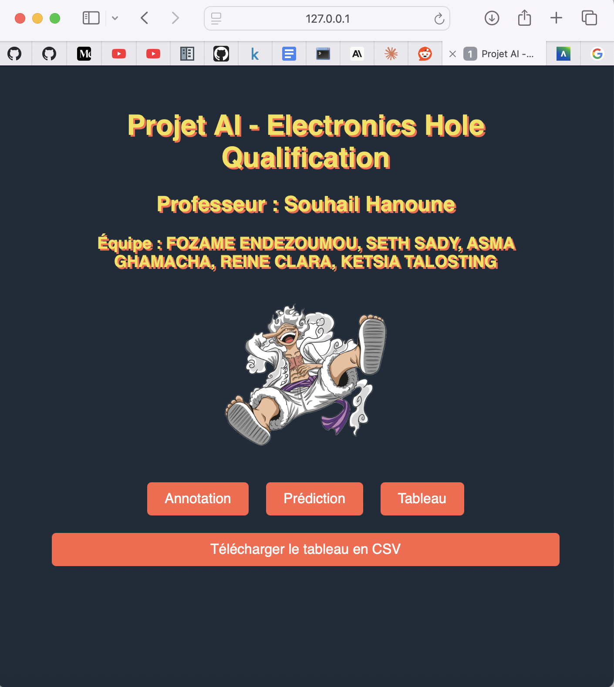
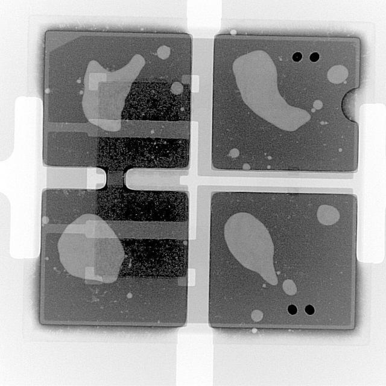
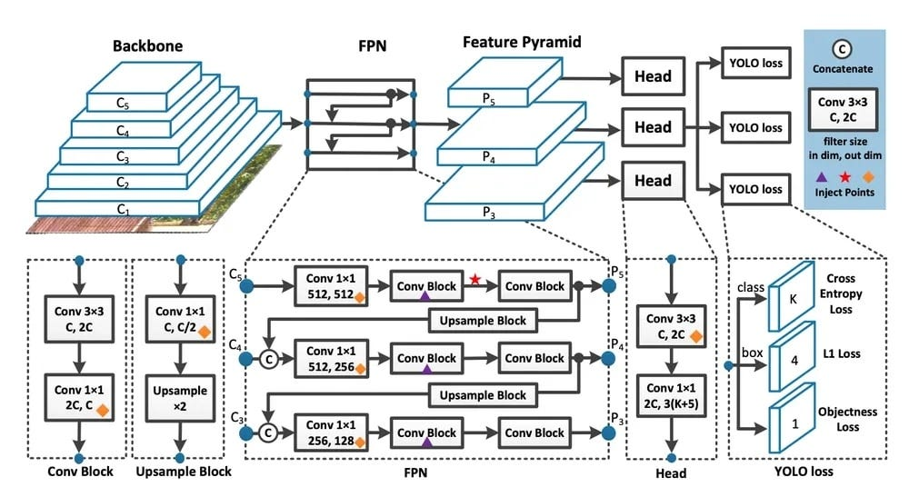
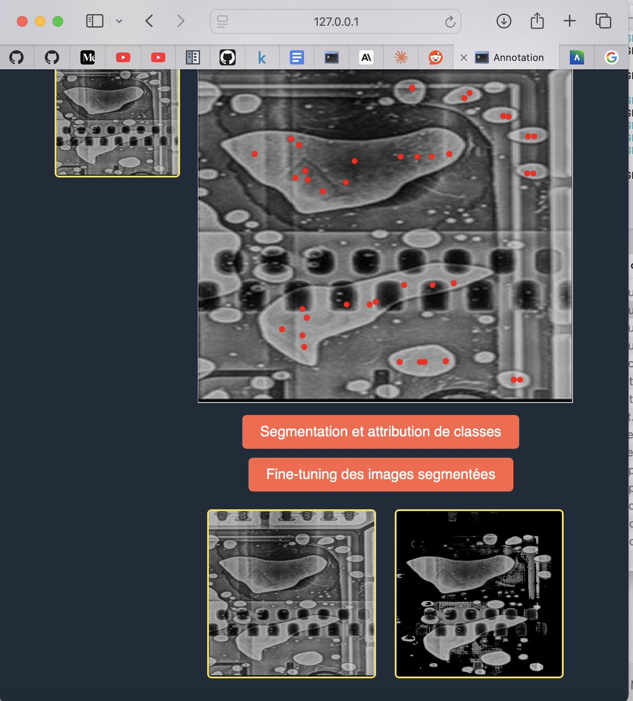
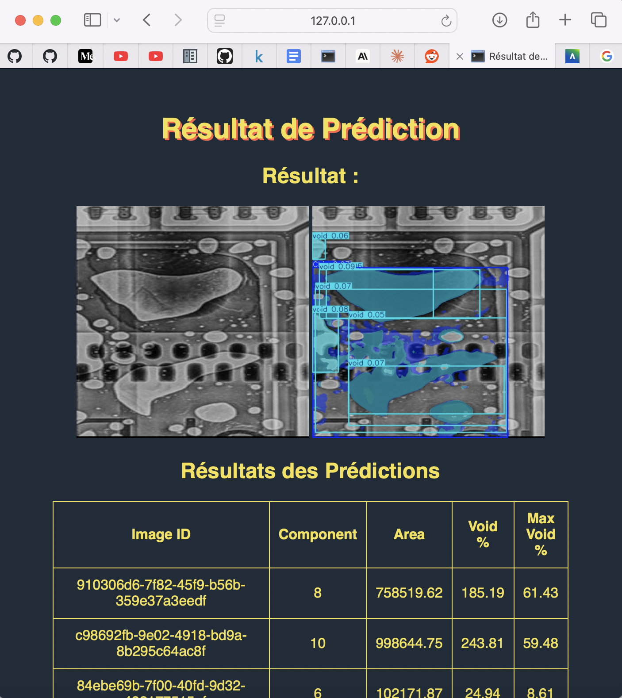
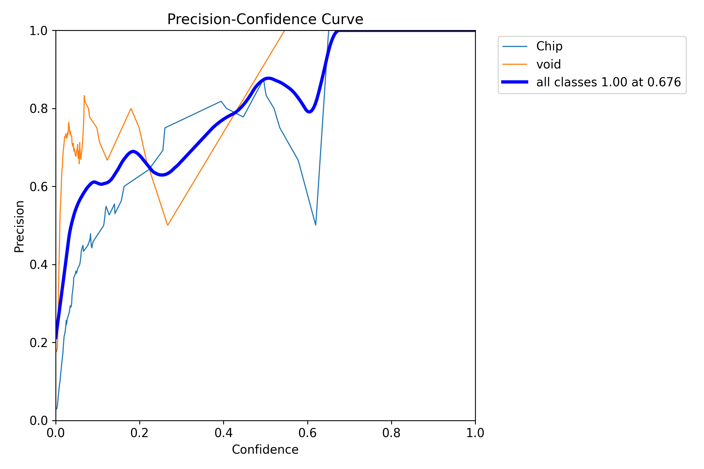
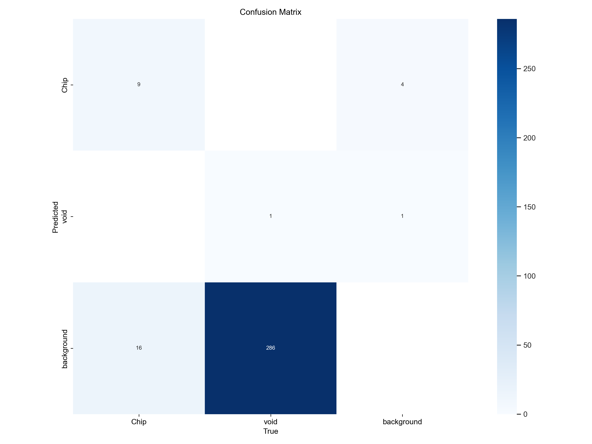

# Electronics Hole Qualification Project

## Introduction

This project was developed by a team of Aivancity students under the supervision of **Dr. Souhail Hanoune**. *The primary objective is to gain a comprehensive understanding of the entire machine learning lifecycle—from data collection to model deployment—by applying these concepts to a practical problem in electronics manufacturing*.

The focus is on detecting chips and voids in electronic components using deep learning techniques. While the dataset is limited, the emphasis is on the deployment process rather than achieving state-of-the-art model performance.

## Objective

The main goal of this project is to implement and deploy a YOLO-based segmentation model capable of detecting chips and voids in electronic components. This serves as a practical exercise in deploying machine learning models and understanding the challenges involved in bringing such models to a production environment.

## Dataset and Preprocessing

Due to constraints in data availability, a small dataset comprising images of electronic components was used. Each image is annotated to identify chips and voids, which are critical defects in electronics manufacturing.

### Sample Dataset Images:
- **Figure 1:** An electronic component 
  

## Model Training

*The model was trained using the YOLOv8 Nano architecture over 25 epochs*. **YOLO (You Only Look Once) is a state-of-the-art, real-time object detection algorithm known for its balance between speed and accuracy**. The Nano version is optimized for faster inference with minimal computational resources, making it suitable for deployment scenarios.

## Model Architecture Diagram:
- **Figure 2:** YOLOv8 Nano architecture overview.

  

## Deployment

The deployment phase involved creating a web application using Flask, a lightweight web framework for Python. The application provides an interactive user interface with three main functionalities:

1. **Annotation with SAM (Segment Anything Model):** Allows users to upload images and perform segmentation using the pre-trained SAM model. Users can annotate images and assign classes to different regions, facilitating the creation of custom datasets.
2. **Prediction and Detection:** Enables users to upload images and receive predictions on the presence of chips and voids. The application displays the detected defects along with statistical information.
3. **CSV Export:** Users can download a CSV file containing detailed statistics of the predictions, which can be used for further analysis or reporting.

## Functionality Overview

### 1. Annotation with SAM

The **Segment Anything Model (SAM)** is integrated into the application to assist users in annotating images. Users can:

- Upload images for annotation.
- Use interactive tools to segment different regions.
- Assign classes (e.g., chip, void) to the segmented regions.
- Fine-tune the segmentation results for improved accuracy.

**Annotation Interface Screenshot:**
- **Figure 3:** The annotation interface showing segmentation tools and class assignment options.

  

### 2. Prediction and Detection

The application leverages the trained YOLOv8 Nano model to detect defects in uploaded images. Key features include:

- **Efficient Detection:** Quick processing of images to identify chips and voids.
- **Statistical Output:** Provides detailed statistics such as the number of components detected, total area affected, void percentage, and maximum void percentage.
- **Visual Results:** Displays the original image alongside the annotated image highlighting the detected defects.

**Prediction Results Screenshot:**
- **Figure 4:** Example of prediction results showing detected defects on an electronic component.

  

### 3. CSV Download

Users can download a CSV file containing the statistics of all predictions made during the session. The CSV includes the following fields:

| image_id | components | area | void% | max void % |
|----------|------------|------|-------|------------|
| ...      | ...        | ...  | ...   | ...        |

## Results

Despite the limited dataset, the deployed model demonstrates the ability to detect chips and voids in electronic components effectively. The application provides a practical tool for visualizing defects and obtaining quantitative measures, which are valuable for quality control in manufacturing.

**Performance Metrics:**

- **Detection Accuracy:** Due to the small dataset, quantitative metrics are limited. However, the model shows promising results in identifying defects in the provided images.
- **Processing Speed:** The YOLOv8 Nano model ensures fast inference times suitable for real-time applications.

**Performance Charts:**

- **Figure 5:** A graph showing the model’s training loss over epochs.

  

- **Figure 6:** A confusion matrix illustrating the model’s performance on validation data.

  

## Conclusion

The project successfully demonstrates the deployment of a machine learning model for detecting defects in electronic components. Key takeaways include:

- **End-to-End Implementation:** From data preparation to model deployment, the project covers all stages of a machine learning pipeline.
- **Deployment Focus:** Emphasizing deployment over model optimization provides insights into practical challenges faced when bringing models to production.
- **Interactive Application:** The Flask web application offers a user-friendly interface for both technical and non-technical users to interact with the model.

## Future Work

Potential improvements and extensions of this project include:

- **Dataset Expansion:** Collecting more data to improve model accuracy and generalization.
- **Model Optimization:** Experimenting with larger models or different architectures to enhance detection performance.
- **Real-Time Deployment:** Integrating the model into a real-time system for on-the-fly defect detection in manufacturing lines.
- **User Interface Enhancements:** Improving the web application’s design for better user experience, including responsive layouts and advanced visualization tools.

## Acknowledgments

We extend our gratitude to **Dr. Souhail Hanoune**. His expertise was invaluable in navigating the complexities of machine learning deployment.